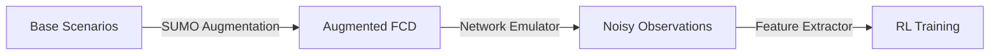

# Simulation Training Pipeline (Sim-to-Real)

**Purpose:** Generate massive, labeled training datasets for RL using SUMO + Python Emulator.
**Approach:** Pure Simulation Training -> Zero-Shot Transfer to Real Hardware.
**Status:** Active | SUMO v1.25.0+

---

## 🚀 Pipeline Overview

We do **not** train on real-world data. We train entirely in simulation to ensure safety and scalability.



1.  **Base Scenarios:** "Perfect" SUMO scenarios (convoy, intersection, braking).
2.  **Augmentation:** Randomize speeds, gaps, reaction times (±20%).
3.  **Network Emulator:** Apply measured ESP-NOW defects (Latency, Loss, Jitter) to create "Noisy" data.
4.  **Training:** RL Agent learns to drive robustly despite the noise.

---

## 🛠️ Environment Setup

### 1. Docker Image
We use the official **SUMO v1.25.0+** image.

```bash
# Pull Image (GitHub Registry)
docker pull ghcr.io/eclipse-sumo/sumo:main

# Run GUI (WSLg/Linux)
docker run --rm -v $(pwd):/data:Z -w /data -e DISPLAY=$DISPLAY \
  -v /tmp/.X11-unix:/tmp/.X11-unix:rw \
  ghcr.io/eclipse-sumo/sumo:main sumo-gui -c scenario.sumocfg
```

### 2. Python Dependencies
```bash
pip install pandas numpy gymnasium stable-baselines3 sumolib traci
```

---

## 📂 Stage 1: Scenario Generation (SUMO)

**Goal:** Create "Ground Truth" trajectories.

### Input Files
- `network.net.xml`: Road geometry.
- `vehicles.rou.xml`: Traffic flow.
- `ssm.add.xml`: Safety metrics (TTC, DRAC) for labeling.

### Augmentation Script (`ml/scripts/gen_scenarios.py`)
Generates variations of the base `.rou.xml`.

| Parameter | Range | Description |
|-----------|-------|-------------|
| `speed_factor` | 0.8 - 1.2 | Vehicle target speed variance |
| `decel` | 3.5 - 6.0 m/s² | Max braking capability |
| `sigma` | 0.3 - 0.7 | Driver imperfection (0=perfect, 1=random) |
| `minGap` | 1.5 - 4.0 m | Standing distance between cars |

**Output:** `fcd_output.xml` (Floating Car Data) containing perfect X,Y,Speed,Heading.

#### Route + Peer Augmentation (Optional)
To introduce **route diversity** and **peer-count variation** without lane changes:
- Define multiple `<route>` IDs in `vehicles.rou.xml` (e.g., `route_main`, `route_alt1`, `route_alt2`).
- Randomize non-ego routes and optionally drop peers during generation.

Example:
```bash
python -m ml.scripts.gen_scenarios \
  --base_dir /base \
  --output_dir /output \
  --seed 42 \
  --train_count 16 \
  --eval_count 4 \
  --route_randomize_non_ego \
  --peer_drop_prob 0.3 \
  --min_peers 1
```

**Notes:**
- V001 depart time remains fixed at `t=0` (validated).
- Default behavior remains unchanged unless the new flags are passed.

---


## 📶 Stage 2: Network Emulation (Python)

**Goal:** Degrade the perfect data to match ESP-NOW reality.

**Script:** `apply_network_effects.py`
**Input:** `fcd_output.xml` (Perfect)
**Config:** `emulator_params.json` (Derived from real RTT characterization)

### Effect Logic
1.  **Latency:** $Delay = \text{Base}(15ms) + \text{Jitter}(\sigma=5ms)$
2.  **Packet Loss:** $P(Loss) = 0.02 + 0.1 \times \text{DistanceFactor}$
3.  **Burst Loss:** If previous packet lost, $P(Loss)$ increases to 20%.
4.  **Staleness:** If packet lost, hold last known value + increment `age`.

**Output:** `training_data.csv` (Noisy observations seen by V001).

---


## 🧠 Stage 3: RL Training

**Goal:** Train TFLite-compatible policy.

**Observation Space (Normalized):**
- Ego Speed, Accel
- Peer Relative Dist, Speed, Accel (Noisy)
- Peer Message Age (Staleness)

**Action Space (Discrete):**
- 0: Maintain
- 1: Caution (LED Yellow)
- 2: Warning (LED Red)
- 3: Emergency Brake (Buzzer)

**Reward Function:**
$$R = R_{safety} + R_{comfort} + R_{efficiency}$$
- **Safety:** Penalty for TTC < 1.5s
- **Comfort:** Penalty for Jerk > threshold
- **Efficiency:** Reward for Speed ~= Limit

---


## 📊 Dataset Stats (Target)

| Category | Count | Rows (10Hz) |
|----------|-------|-------------|
| Convoy (Base) | 10 | 60,000 |
| Intersection | 5 | 30,000 |
| Edge Cases | 20 | 120,000 |
| **Total** | **35** | **~210,000** |

---

**Last Updated:** January 1, 2026
**Linked Plans:**
- `docs/10_PLANS_ACTIVE/ESPNOW_CHARACTERIZATION_IMPLEMENTATION.md` (Source of `emulator_params.json`)

```
